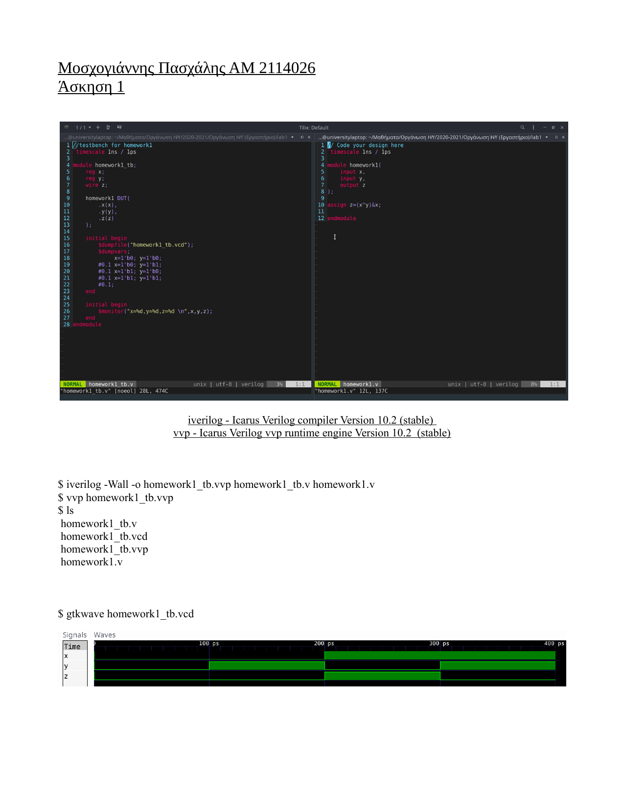

# Computer Organization

### Verilog Simulation with Icarus Verilog (iverilog)

This repository contains Verilog files for simulating hardware designs, along with instructions for compiling and running the simulation using Icarus Verilog (`iverilog`).


## Project Description



## Usage

### Running the Simulation

Follow these steps to compile and run the Verilog testbench using Icarus Verilog (iverilog) and execute the simulation.

### Compilation

Use the following command to compile the Verilog testbench:

```bash
iverilog -Wall -o homework8_b_tb.vvp homework8_b_tb.v
vvp homework8_b_tb.vvp


## Contributors

- Paschalis Moschogiannis (Contact: [pmoschogiannis@uth.gr](mailto:pmoschogiannis@uth.gr))


## License

This project is licensed under the [MIT License](LICENSE).
